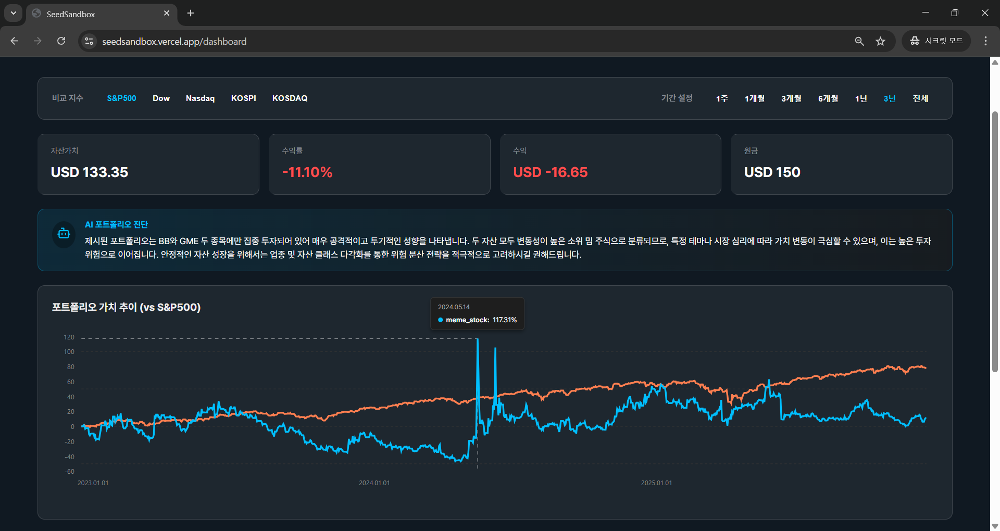
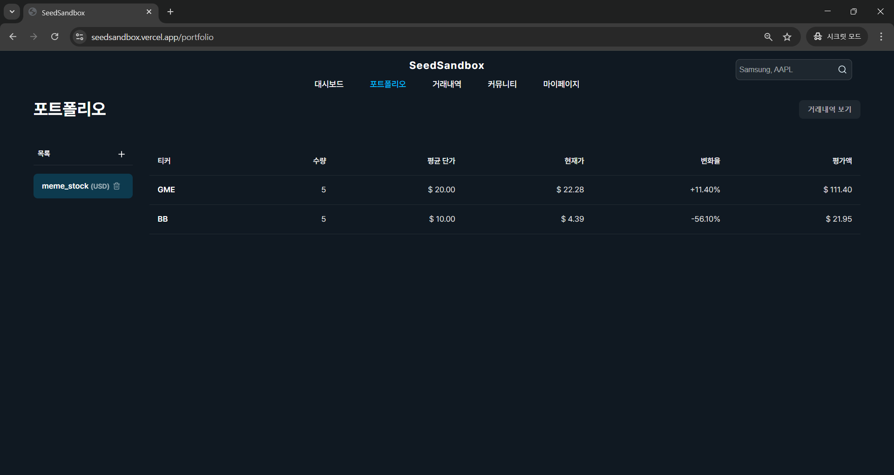
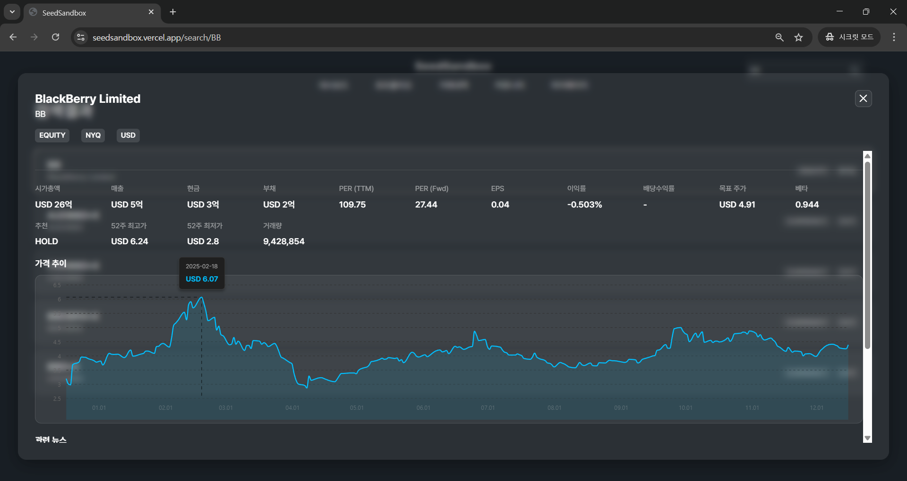
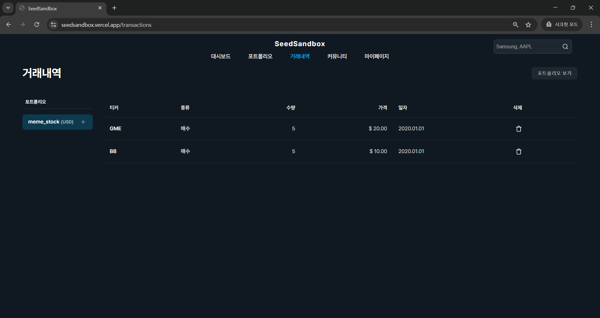
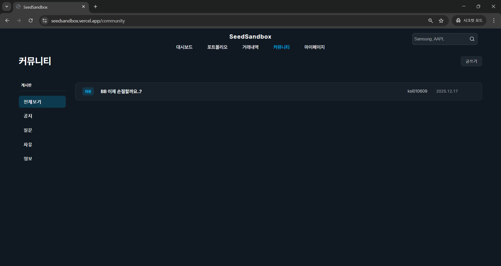

# SeedSandbox

"The Safest Laboratory to Start Investing" — Risk Analysis & Mock Trading Platform for Beginners


---

## Overview

SeedSandbox is a web frontend that provides a safe, sandboxed environment for beginner investors to practice trading, inspect risk exposures, and learn portfolio construction without real capital. It blends interactive visual analytics and an AI-backed diagnosis layer to make financial concepts actionable and comprehensible.

The interface emphasizes clarity for financial data (returns, volatility, correlations) and brings domain-aware tooling to the novice investor.

---

## Key Features

### 1. Smart Dashboard & AI Diagnosis

**Gain objective insights by comparing your performance against the market benchmark.**

- **Interactive Time-Series Chart:** Visualizes portfolio returns vs. S&P 500 with dynamic time-frame filtering (1W to 3Y) and re-basing logic.
- **Global Market Overview:** Tracks key indices including **Dow, Nasdaq, KOSPI, and KOSDAQ** alongside your total asset summary.
- **AI-Powered Diagnosis:** Leverages **Gemini 2.5 Flash** to generate natural language reports analyzing your investment style, sector concentration, and potential risks.



<br/>

### 2. Advanced Risk Analytics

**Go beyond simple returns with professional quantitative metrics.**

- **Comparative Risk Metrics:** Visualizes **Volatility, Beta, Sharpe Ratio, and MDD**, directly comparing your portfolio against the S&P 500 benchmark.
- **Correlation Heatmap:** A color-coded matrix (-1 to 1) to analyze price correlation between assets, helping users optimize diversification strategies.


<br/>

### 3. Portfolio Management

**Track your asset status with real-time data precision.**

- **Performance Tracking:** detailed breakdown of **Average Price vs. Current Price** to calculate exact Profit/Loss (PnL) percentages.
- **Dynamic Currency Conversion:** Supports real-time toggling between **USD and KRW**, automatically handling exchange rates for total valuation.
- **Holdings Management:** Intuitive interface to view, add, or remove assets with instantaneous valuation updates.



<br/>

### 4. Stock Search & Deep Analysis

**Access comprehensive financial data before making decisions.**

- **Key Financial Indicators:** Provides essential fundamental data including **Market Cap, PER, EPS, and Revenue** sourced via Yahoo Finance API.
- **Interactive Price Chart:** Visualizes historical price trends with a scrubbing interface for detailed price checks.
- **News Integration:** Aggregates relevant news articles to help users stay informed about market sentiment.



<br/>

### 5. Transaction History

**Maintain a transparent record of all trading activities.**

- **Audit Log:** Chronologically records all Buy/Sell execution details (Date, Price, Quantity).
- **Data Integrity:** Allows users to delete erroneous records, automatically triggering a recalculation of the entire portfolio's metrics.



<br/>

### 6. Community & Insights

**Share ideas and grow with other investors.**

- **Categorized Discussion Board:** Features a robust bulletin board with category filtering (Notice, Free, Q&A).
- **Collective Intelligence:** Engage with the community through posts and comments to refine investment ideas.

## 

---

## Tech Stack

### Frontend & Core

   

### State Management & Visualization

 

### Data & AI

 

### Infrastructure & Auth

 

### Tooling

 

<br/>

**Details:**

- **Frontend:** `React`, `TypeScript`, `Vite`, `SCSS`
- **State Management:** `Jotai`
- **Visualization:** `Nivo`
- **Data & AI:** `yahoo-finance2`, `Gemini-2.5-Flash`
- **Authentication:** `Firebase Auth`
- **Deployment:** `Vercel`

---

## Problem Solving — Technical Challenges & Solutions

Ensuring the reliability of financial data was critical for SeedSandbox. Below are key engineering challenges faced during development and the solutions implemented to resolve them.

### 1) Architecture Improvement: Data Ingestion Strategy

**Problem:**
Initially, raw REST API calls were used to fetch market data. However, the raw response structure was **fragmented** (timestamps and price values were separated into different arrays), requiring complex, brittle parsing logic that was prone to errors when API versions changed.

**Solution:**
Refactored the data layer by integrating the **`yahoo-finance2`** library. This library provides strictly typed interfaces and pre-validated data structures, eliminating the need for manual array mapping.

**Result:**

- **Code Reduction:** Reduced data processing boilerplate code by **over 50%**.
- **Maintainability:** Improved type safety with TypeScript, making the codebase more resilient to upstream API changes.

```ts
// Before: Manual parsing (Complex & Error-prone)
// After: Structured & Typed response using library
import yahooFinance from "yahoo-finance2";

const series = await yahooFinance.historical("AAPL", {
  period1: "2024-01-01",
  period2: "2024-12-31",
});
// series => [{ date: Date, open: number, close: number, high: number, low: number, volume: number }, ...]
```

---

### 2) Stability: Defensive Data Preprocessing

**Problem:**
Inconsistent data from external APIs (e.g., missing fields, null values, or delisted symbols) caused runtime errors during chart rendering, leading to a poor user experience (White Screen of Death).

**Solution:**
Implemented a **Defensive Programming** layer using strict preprocessing filters before passing data to the UI. This ensures that only complete and valid datasets reach the visualization components.

**Implementation Logic:**

1. **Validation:** Filter out assets with missing `symbol` or `price` data.
2. **Sanitization:** Convert `null`/`undefined` values to safe defaults (e.g., `0` or `N/A`).

```ts
// Example: Defensive filtering logic
const cleanedAssets = rawAssets
  .filter((item) => item?.symbol && item?.prices?.length > 0) // Strict filtering
  .map((item) => ({
    ...item,
    prices: item.prices.filter((p) => p.date && p.close !== null), // Data integrity check
  }));
```

**Result:**

- Zero Crashes: Prevented UI breakdowns caused by malformed data.
- Reliability: Significantly improved the stability of the Dashboard and Risk Analysis charts.

---

## Getting Started

Follow these steps to set up the project locally.

### Prerequisites

Make sure you have the following installed on your machine:

- **Node.js** >= 18.0.0
- **npm** or **yarn**

### Installation

```bash
# 1. Clone the repository
git clone [https://github.com/ksi010609/SeedSandbox-FE.git](https://github.com/ksi010609/SeedSandbox-FE.git)

# 2. Navigate to the project directory
cd SeedSandbox-FE

# 3. Install dependencies
npm install
# or
yarn install
```

### Environment Setup

Create a `.env` file in the root directory of the frontend project.

> **Note:** This file contains sensitive keys and should **not** be committed to version control (Git).

Copy the following template and fill in your specific configuration values:

```bash
# 1. Firebase Configuration (Authentication)
# Retrieve these values from: Firebase Console > Project Settings > General
VITE_FIREBASE_APIKEY=your_api_key
VITE_FIREBASE_AUTH_DOMAIN=your_project_id.firebaseapp.com
VITE_FIREBASE_PROJECT_ID=your_project_id
VITE_FIREBASE_STORAGE_BUCKET=your_project_id.appspot.com
VITE_FIREBASE_MESSAGING_SENDER_ID=your_sender_id
VITE_FIREBASE_APP_ID=your_app_id
VITE_FIREBASE_MEASUREMENT_ID=your_measurement_id

# 2. Backend API Endpoint
# The URL where your Express.js server is running (e.g., http://localhost:8080 or deployed EC2 URL)
VITE_SERVER_IP=http://localhost:8080
```

### Run Locally

Start the development server:

```bash
npm run dev
```

Open your browser and navigate to the URL shown in the terminal (usually http://localhost:5173).

### Build for Production

To build the app for production deployment:

```bash
npm run build
npm run preview
```

---

## Backend Repository

The frontend interacts with a dedicated backend service that handles business logic, portfolio persistence, and AI orchestration.

> **Note:** Detailed documentation regarding **System Architecture**, **Database Schema**, and **API Specifications** can be found in the backend repository.

**Repository Link:** [https://github.com/your-username/SeedSandbox-BE](https://github.com/your-username/SeedSandbox-BE)

---

## Contributing

While this is primarily a personal portfolio project, I am open to code reviews and feedback to improve code quality.

1. Fork the project.
2. Create your feature branch (`git checkout -b feature/AmazingFeature`).
3. Commit your changes (`git commit -m 'Add some AmazingFeature'`).
4. Push to the branch (`git push origin feature/AmazingFeature`).
5. Open a Pull Request.

---

## License & Contact

- **License:** Distributed under the MIT License. See `LICENSE` for more information.
- **Contact:**
  - **Email:** ksi010609@gmail.com
  - **GitHub:** [https://github.com/ksi010609](https://github.com/ksi010609)

---

## Acknowledgements

Special thanks to the open-source community for the tools that made this project possible.

- **Financial Data:** [yahoo-finance2](https://github.com/gadicc/node-yahoo-finance2)
- **Visualization:** [Nivo Charts](https://nivo.rocks/)
- **State Management:** [Jotai](https://jotai.org/)
- **AI Model:** [Google Gemini API](https://ai.google.dev/)
- **Authentication:** [Firebase](https://firebase.google.com/)
